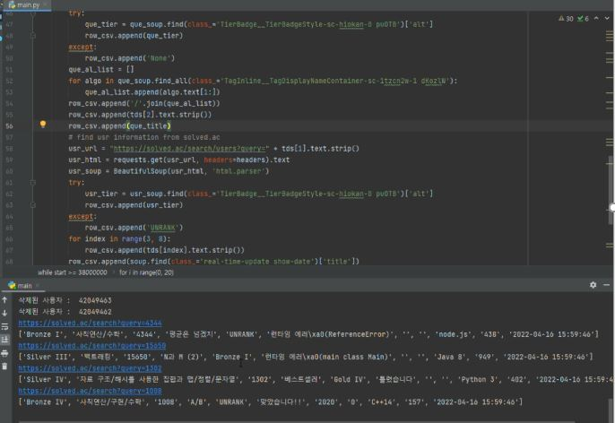
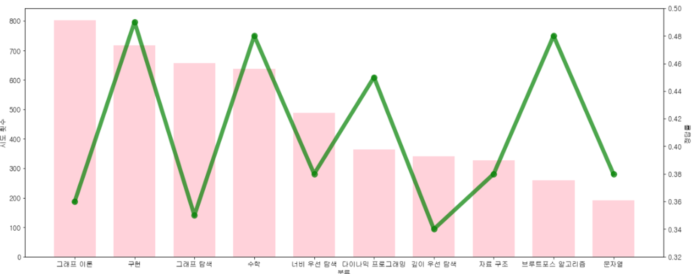
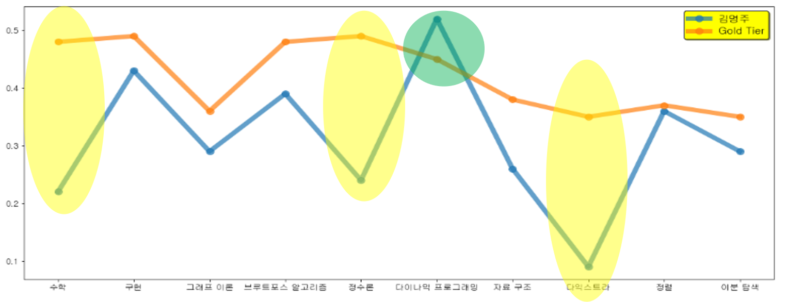
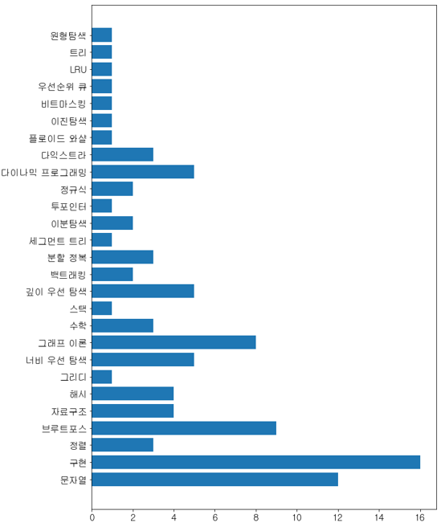

<div align="center">
  <h1 align="center">BAEKJOON BIGDATA ANALYSIS </h1>
</div>

<!-- TABLE OF CONTENTS -->
<details>
  <summary>Table of Contents</summary>
  <ol>
    <li>
      <a href="#about-the-project">About The Project</a>
      <ul>
        <li><a href="#built-with">Built With</a></li>
      </ul>
    </li>
    <li>
      <a href="#getting-started">Getting Started</a>
      <ul>
        <li><a href="#prerequisites">Prerequisites</a></li>
        <li><a href="#installation">Installation</a></li>
      </ul>
    </li>
    <li><a href="#acquisition">Acquisition</a></li>
    <li><a href="#analysis--visualization">Analysis & Visualization</a></li>
    <li><a href="#contribution">Contribution</a></li>
    <li><a href="#contact">Contact</a></li>
  </ol>
</details>


<!-- ABOUT THE PROJECT -->
## About The Project

The project is an analysis of "Baekjoon Online Judge(BOJ)" and is a project that induces people preparing for coding tests using big data to use their time efficiently.

You can check the type of coding test by company, the algorithm ability that you lack, and the trend that you see as the type of algorithm that you try the most.

### What is Baekjoon Online Judge?


It is an algorithm training site established in 2010 by Choi Baek-joon, then a student of Sogang University's Department of Computer Engineering, and is one of the information science algorithm training sites in Korea. The biggest feature is that it has many problems and supports famous programming languages such as C, Java, Python, and even minor languages such as BrainF**k and Whitespace. In addition, it is very helpful for programmers who prepare for the ICPC and the Korea Information Olympiad or study algorithms as it summarizes past problems of various competitions.
<p align="center">  </p>
Currently, Baekjoon is also providing a service that can identify the difficulty of the problem and the level of the user in connection with solved.ac


### Built With

List frameworks/libraries in my project.

* [Python](https://www.python.org/)
* [Jupyter](https://www.anaconda.com/products/distribution)


## Getting Started

This is an example of how you may give instructions on setting up your project locally.
To get a local copy up and running follow these simple example steps.

### Prerequisites
1. Install Anaconda
2. Install Python
3. After crawling branch clone, clone the analysis branch.

### Installation

1. Clone the feature/crawling
   ```
    git clone -b feature/crawling --single-branch https://github.com/myeongju-kim/Baekjoon_Analysis
   ```
2. Install module
   ```
   pip install -r requirments.txt
   ```
3. You will acquire csv by scraping

   (It provides a sample file, so it doesn't matter if you use it)
4. Clone the feature/analysis
   ```
   git clone -b feature/analysis --single-branch https://github.com/myeongju-kim/Baekjoon_Analysis
   ```
5. Run ipynb file!


## Acquisition
Data from websites are acquired using crawling and scraping.
```
    # 1. Scraping the user scoring status table at the Baekjun site
    url = "https://www.acmicpc.net/status?top=" + str(start)
    html = requests.get(url, headers=headers).text
    soup = BeautifulSoup(html, 'html.parser')
```
```
    # 2. Scraping user, question information from solved.ac
    que_url = "https://solved.ac/search?query=" + tds[2].text
    que_html = requests.get(que_url, headers=headers).text
    que_soup = BeautifulSoup(que_html, 'html.parser')
```

<p align="center"></p>

## Storage
It does not occupy a large capacity because some data are currently collected. So I saved it in csv format in local storage.

## Analysis & Visualization 
(1) The algorithms that Gold Tier tries the most and the correct answer rate



(2) Comparison of correct answer rates for specific gold tier users and overall gold tier



(3) Classification of Kakao coding test algorithms

<p align="center"></p>

## Contribution
Contributions are what make the open source community such an amazing place to learn, inspire, and create. Any contributions you make are **greatly appreciated**.

If you have a suggestion that would make this better, please fork the repo and create a pull request. You can also simply open an issue with the tag "enhancement".
Don't forget to give the project a star! Thanks again!

1. Fork the Project
2. Create your Feature Branch 
3. Commit your Changes 
4. Push to the Branch
5. Open a Pull Request

## Contact

mjoo1106@naver.com
